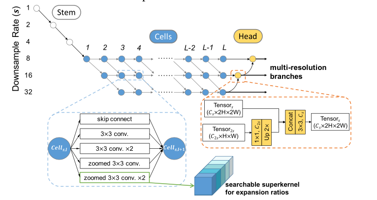

# 摘要

    我们提出了FasterSeg，这是一个自动设计的语义分割网络，不仅具有最先进的性能，而且比现有方法的速度更快。利用神经架构搜索（NAS），FasterSeg是从一个新的更广泛的搜索空间中发现的，该搜索空间集成了多分辨率分支，最近发现这在手动设计的分割模型中至关重要。为了更好地校准高精度和低延迟目标之间的平衡，我们提出了一种解耦的细粒度延迟正则化，有效地克服了我们观察到的现象，即搜索的网络容易“崩溃”为低延迟但精度较差的模型。此外，我们无缝地将FasterSeg扩展到一个新的协作搜索（协同搜索）框架，在同一次运行中同时搜索教师和学生网络。师生蒸馏进一步提高了学生模型的准确性。在流行的细分基准测试上的实验证明了FasterSeg的能力。例如，FasterSeg的运行速度比城市景观上最接近的手动设计竞争对手快30%以上，同时保持相当的准确性。

# 1 简介

    语义分割预测图像不同语义类别的像素级注释。尽管由于卷积神经网络（CNN）的繁荣（Long等人，2015），分割模型的性能取得了突破，但作为一项密集的结构化预测任务，通常由于卷积的叠加和多尺度特征的聚合，以及输入图像分辨率的提高，分割模型的内存成本和延迟都很高。然而，近年来，人们对实时使用语义分割的需求快速增长，例如自动驾驶。这激发了人们对设计低延迟、更高效的分段网络的热情，同时又不显著牺牲准确性（Zhao等人，2018年；Yu等人，2018a）。

    最近神经结构搜索（NAS）算法的成功为设计更好的语义分割模型开辟了新的领域，尤其是在其他资源约束的延迟下。Auto DeepLab（Liu等人，2019a）首次引入网络级搜索空间，以优化分割任务的分辨率（以及单元结构）。Zhang et al.（2019）和Li et al.（2019）采用预定义的网络级空间分辨率模式，搜索具有延迟约束的操作和解码器。尽管取得了一些初步的成功，但我们观察到，在设计细分模型方面成功的人类领域专业知识似乎尚未完全集成到NAS框架中。例如，人类设计的实时分割架构（Zhao et al.，2018；Yu et al.，2018a）通常利用具有适当深度、宽度、运算符和下采样率的多分辨率分支，并发现它们对成功起到了至关重要的作用：现有NAS分割工作并没有释放出这种灵活性。此外，两个（有点冲突的）目标之间的权衡，即高精度和低延迟，也使得搜索过程不稳定，容易出现“糟糕的局部极小”架构选项。

    正如一句名言所说：“不学习历史的人注定要重蹈覆辙”。我们继承并受手工制作的高效分割的成功实践的启发，提出了一个名为FasterSeg的新型NAS框架，旨在实现极快的推理速度和具有竞争力的准确性。我们设计了一个特殊的搜索空间，能够支持不同分辨率的多个分支的优化，而不是单个主干。这些搜索到的分支被自适应地聚合以进行最终预测。为了进一步平衡准确度与延迟之间的关系，并避免向这两个指标（例如，良好的延迟但较差的准确度）倾斜，我们设计了一种解耦的细粒度延迟正则化，这有助于在延迟和准确度之间进行更灵活有效的校准。此外，我们的NAS框架可以很容易地扩展到协作搜索（协同搜索），即在一次运行中联合搜索复杂的教师网络和轻型学生网络，而这两个模型通过特征提取进行耦合，以提高学生的准确性。

我们将我们的主要贡献总结如下：

* 为实时分割量身定制的新型NAS搜索空间，在这里可以灵活搜索和聚合多分辨率分支
* 一种新的解耦细粒度延迟正则化，成功地缓解了延迟受限搜索中的“架构崩溃”问题
* 首次对师生合作搜索进行了新的扩展，我们将教师提取给学生，以进一步提高后者的准确性
* 大量实验表明，FasterSeg实现了极快的速度（比城市景观上最接近的手动设计竞争对手快30%以上），并保持了竞争精度

# 2 相关工作

    如今，人类设计的CNN架构实现了良好的精度性能（He等人，2016；Chen等人，2018b；Wang等人，2019；Sun等人，2019）。然而，设计架构以平衡准确性和其他资源约束（延迟、内存、触发器等）需要更多的人力。为了将人类专家从这一具有挑战性的权衡中解放出来，最近引入了神经架构搜索（NAS），并引起了极大的兴趣（Zoph&Le，2016；Brock等人，2017；Pham等人，2018；Liu等人，2018a；Chen等人，2018a；Bender等人，2018；Chen等人，2018c；Gong等人，2019）。这些工作通过组合损失函数（Wu等人，2019年）或政策学习的混合奖励信号（Tan等人，2019年；Cheng等人，2018年）或约束优化公式（Dai等人，2019年），优化精度和资源利用率。

    大多数现有的资源感知NAS工作都集中在分类任务上，而语义分割对细节和丰富上下文的保存有更高的要求，因此对高效的网络设计提出了更多的难题。幸运的是，以前用于实时分段的手工架构已经确定了几种一致且成功的设计模式。ENet（Paszke等人，2016年）采用了早期下采样，ICNet（Zhao等人，2018年）在标签指导下进一步纳入了多分辨率分支的特征图。BiSeNet（Yu等人，2018a）融合了具有快速下采样的上下文路径和具有较小过滤步长的空间路径。在计算成本（He等人，2019年；Marin等人，2019年）和内存使用率（Chen等人，2019年）方面，更多的工作针对分割效率。他们的多分辨率分支和聚合设计确保了足够大的接收场（上下文），同时保留了高分辨率的细节，为如何进一步优化体系结构提供了重要线索。

    最近有研究开始将NAS算法用于分割任务。AutoDeepLab（Liu等人，2019a）率先在这一方向上搜索单元和网络级下采样率，以灵活地控制整个网络的空间分辨率变化。Zhang et al.（2019）和Li et al.（2019）将资源约束引入NAS细分。还自动搜索了多尺度解码器（Zhang等人，2019年）。然而，与手动设计的架构相比，这些搜索模型仍然遵循单一主干设计，在设计搜索空间时没有充分利用先前的智慧（例如，多分辨率分支）。

    最后，我们简要回顾了知识提炼（Hinton et al.，2015），其目的是将所学知识从复杂的教师网络转移到体重较轻的学生身上，以提高（更有效的）学生的准确性。对于分割，Liu et al.（2019b）和Nekrasov et al.（2019）提出利用知识提取来提高紧凑模型的准确性并加快收敛速度。之前还没有将蒸馏与NAS联系起来的工作，我们将首次通过整合师生模型协作搜索来引入FasterSeg的扩展。

# 3 FASTERSEG：更快的实时分割

    我们的FASTERSEG是从一个高效、多分辨率的搜索空间中发现的，它的灵感来自于以前的手工设计成功。为了克服“体系结构崩溃”的挑战，提出了细粒度延迟正则化（Cheng等人，2018）。然后，我们将FasterSeg扩展到Teacher-student共同搜索框架，进一步实现更轻、更准确的学生网络。

### 3.1 具有多分辨率分支的高效搜索空间

    我们搜索空间背后的核心动机是搜索具有整体低延迟的多分辨率分支，这在之前的手动设计工作中已经证明是有效的（Zhao等人，2018；Yu等人，2018a）。我们的NAS框架基于具有可搜索超级内核的高效单元，自动选择和聚合不同分辨率的分支。

#### 3.1.1可搜索的多分辨率分支

    

    受（Liu等人，2019a）的启发，我们能够在L层单元（图1）内搜索空间分辨率，其中每个单元从两个连接的前驱体获取输入，并输出两个不同分辨率的特征图。手工制作的实时分割网络发现，不同分辨率的多个分支是有效的（Zhao等人，2018年；Yu等人，2018a）。然而，当前NAS算法探索的体系结构仅限于单个主干网。

    我们的目标是在这个L层框架中选择不同分辨率的b（b>1）分支。具体来说，我们可以为最后一层单元选择b个不同的最终输出分辨率，并通过回溯对每个分支进行解码（第3.4节）。这使我们的NAS框架能够探索具有不同分辨率的b个分支，这些分支由head模块逐步“学会聚合”（图1）。

    我们按照惯例在每次分辨率下采样时增加通道数。为了在不引起太多延迟的情况下扩大模型容量，我们首先使用stem模块将输入图像降采样到18原始比例，然后设置可搜索的降采样率s∈ {8, 16, 32}. 图2显示，我们的多分辨率搜索空间能够覆盖现有的人工设计网络，用于实时分割。

#### 3.1.2选择具有大感受野的高效操作

    由于我们旨在提高推理延迟，执行操作的速度是选择操作候选O的一个直接指标（而不是像FLOPs这样的间接指标）。

    同样重要的是，要确保足够大的感受野来适应空间环境。我们分析了典型的操作，包括他们常用的代理延迟测量值（触发器、参数编号），以及他们在带有TensorRT库的NVIDIA 1080Ti GPU上的实际测量延迟，以及他们的接收场，如表1所示。与

    标准卷积相比，组卷积通常用于减少失败次数和参数数量（Sandler et al.，2018；Ma et al.，2018）。两组卷积具有与标准卷积相同的感受野，但速度快13%，同时将参数量减半（这可能不可取，因为它会降低模型学习能力）。扩张卷积具有扩大的感受野，在密集预测中很受欢迎（Chen等人，2018b；Dai等人，2017）。

    然而，如表1所示（并在工程实践中得到广泛认可），扩张卷积（扩张率为2）的延迟显著增加，尽管这并没有直接反映在失败或参数数中。鉴于此，我们设计了一种称为“缩放卷积”的新变体，其中输入特征映射依次通过双线性下采样、标准卷积和双线性上采样进行处理。与标准卷积相比，这种特殊设计的延迟降低了40%，感受野增大了2倍。因此，我们的搜索空间由以下操作组成：
